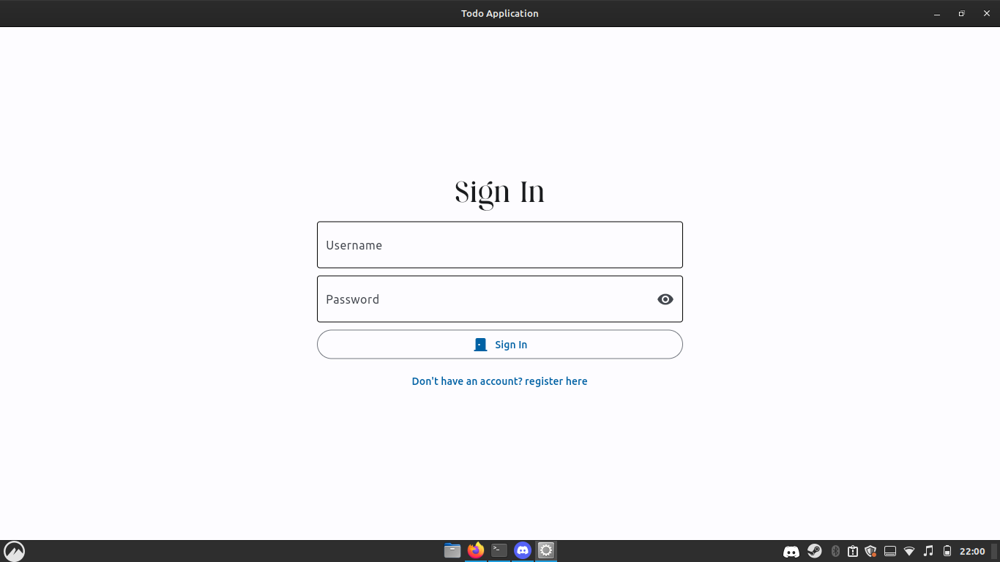
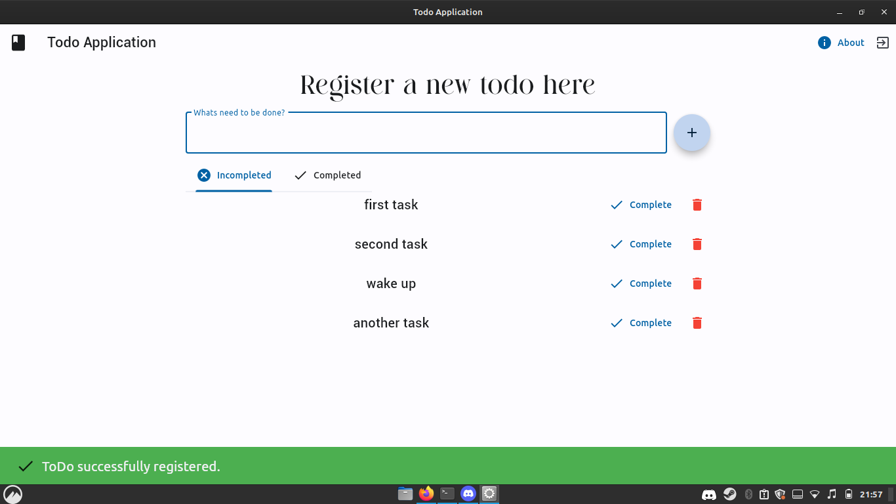

# Flet-Alquemy

## Using flet and SQLALquemy

Hello, in this project are used [flet](https://flet.dev/) to build the <strong>graphical interface</strong> and [SQLAlchemy](https://www.sqlalchemy.org/) to <strong>manage the database</strong>.
Here, each user will have your own list of items where you can insert, update and delete.

### How run?

#### installing dependences
`python -m pip install -r requirements.txt`

#### running
`python main.py`

### Screenshots

